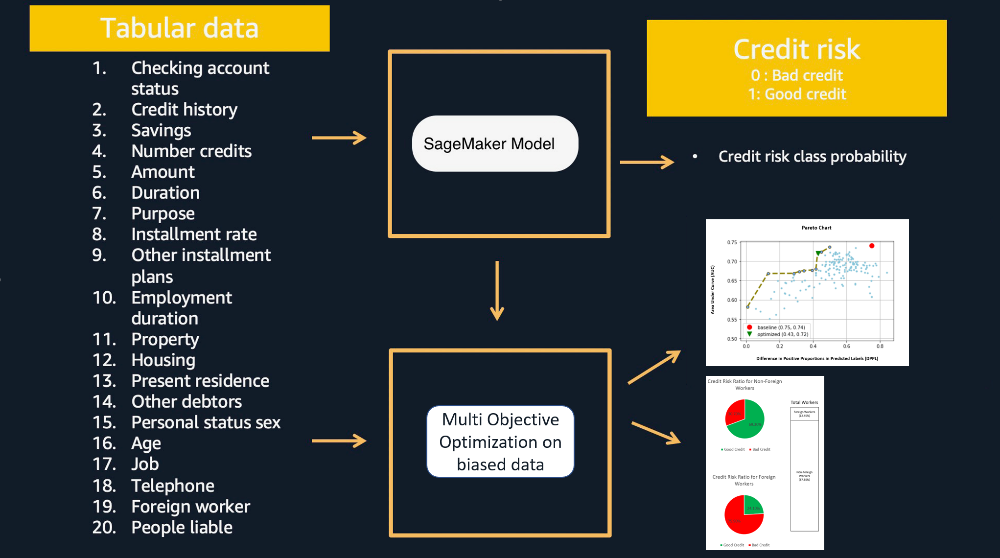

## Credit risk prediction and explainability and bias detection with Amazon SageMaker

In this workshop, we demonstrate a end to end ML use case of credit risk prediction with model explainability and bias detection. We use a well known open source dataset https://archive.ics.uci.edu/ml/datasets/South+German+Credit+%28UPDATE%29 .
We show how to use SageMaker Clarify to run explainability and bias detection on a SageMaker inference pipeline model. We include the explainability and bias reports from Clarify as well as relevant links to further resources on this subject.

## 1. Overview
Amazon SageMaker helps data scientists and developers to prepare, build, train, and deploy high-quality machine learning (ML) models quickly by bringing together a broad set of capabilities purpose-built for ML.

[Amazon SageMaker Automatic Model Tuning](https://docs.aws.amazon.com/sagemaker/latest/dg/automatic-model-tuning.html), also known as hyperparameter tuning, finds the best version of a model by running many training jobs on your dataset using the algorithm and ranges of hyperparameters. It then chooses the hyperparameter values that result in a model that performs the best, as measured by a single performance metric (e.g., accuracy, auc, recall) that we define.

Amazon SageMaker provides pre-made images for machine and deep learning frameworks for supported frameworks such as Scikit-Learn, XGBoost, TensorFlow, PyTorch, MXNet, or Chainer. These are preloaded with the corresponding framework and some additional Python packages, such as Pandas and NumPy, so you can write your own code for model training. See [here](https://docs.aws.amazon.com/sagemaker/latest/dg/algorithms-choose.html#supported-frameworks-benefits) for more information.

[Amazon SageMaker Studio](https://aws.amazon.com/sagemaker/studio/) provides a single, web-based visual interface where you can perform all ML development activities including notebooks, experiment management, automatic model creation, debugging, and model and data drift detection.

In this SageMaker Studio notebook, we highlight how you can use SageMaker to train a model, while considering multiple objectives & fairness when dealing with a biased dataset. 

Below is a high level view of the architecture this lab will take you through:  

Below is the architecture diagram used in the solution:

The notebook performs the following steps:

1. Prepare raw training and test data
2. Create a SageMaker Processing job which performs preprocessing on the raw training data and also produces an SKlearn model which is reused for deployment.
3. Train an XGBoost model on the processed data using SageMaker's built-in XGBoost container
4. Create a SageMaker Inference pipeline containing the SKlearn and XGBoost model in a series
5. Perform inference by supplying raw test data
6. Set up and run explainability job powered by SageMaker Clarify
7. Use open source shap library to create summary and waterfall plots to understand the feature importance better
8. Run bias analysis jobs
9. Clean up

## Lab Instructions

1. In the terminal, type the following command:

git clone https://github.com/aws-samples/amazon-sagemaker-credit-risk-prediction-explainability-bias-detection

2. After completion of step 9 you will have amazon-sagemaker-credit-risk-prediction-explainability-bias-detection folder created in left panel of the studio:

10. Under amazon-sagemaker-credit-risk-prediction-explainability-bias-detection double click on credit_risk_explainability_inference_pipelines_with_output.ipynb and Select Kernel as Python 3 (Data Science)

Congratulations!! You have successfully downloaded the content of the credit risk explainability lab, please follow the instructions in the jupyter notebook.
Please note that links to pdf reports and studio reports for explainability and bias are generated in the notebook.

